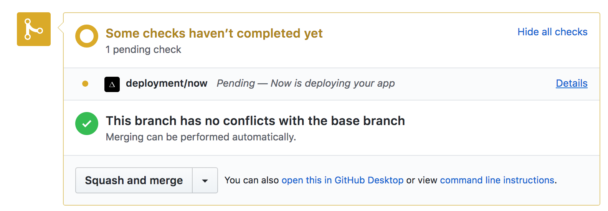

# tiny-blog

> Shows how to use multi-stage Docker build with Cypress tests

See [Dockerfile](Dockerfile) for detailed comments.

Also shows how [Zeit.co GitHub integration](https://zeit.co/blog/now-for-github) tests and deploys each commit. See [example PR](https://github.com/bahmutov/tiny-blog/pull/2)

## GitHub PR

Each PR gets a check from Zeit. Click on "Details" to see the verbose build output




Once the build finishes, you will be redirected to the deployed site. If you do not want to redirect to the deployed site, but would like to see the build text (including test results), copy the url, remove `redirect=1` parameter and open in your browser.

Example output (I have removed timestamps)

```text
====================================================================================================
  (Run Finished)
      Spec                                                Tests  Passing  Failing  Pending  Skipped
  ┌────────────────────────────────────────────────────────────────────────────────────────────────┐
  │ ✔ spec.js                                   00:01        1        1        -        -        - │
  └────────────────────────────────────────────────────────────────────────────────────────────────┘
    All specs passed!                           00:01        1        1        -        -        -
?25h
INFO: Gracefully shutting down. Please wait...
 ---> 0c1b55220b03
Removing intermediate container 7aea2986b90e
Step 13/16 : FROM busybox as PROD
 ---> e1ddd7948a1c
Step 14/16 : COPY --from=TEST /app/public /public
 ---> e0c2947a7de8
Step 15/16 : RUN ls -la
 ---> Running in 87fa2de2de26
total 92
drwxr-xr-x    1 root     root          4096 Aug  4 10:17 .
drwxr-xr-x    1 root     root          4096 Aug  4 10:17 ..
-rwxr-xr-x    1 root     root             0 Aug  4 10:17 .dockerenv
drwxr-xr-x    2 root     root         12288 Jul 31 20:20 bin
drwxr-xr-x    5 root     root           340 Aug  4 10:17 dev
drwxr-xr-x    1 root     root          4096 Aug  4 10:17 etc
drwxr-xr-x    2 nobody   nogroup       4096 Jul 31 20:20 home
dr-xr-xr-x  124 root     root             0 Aug  4 10:17 proc
drwxr-xr-x    2 root     root          4096 Aug  4 10:17 public
drwx------    2 root     root          4096 Jul 31 20:20 root
dr-xr-xr-x   13 root     root             0 Jun 25 16:06 sys
drwxrwxrwt    2 root     root          4096 Jul 31 20:20 tmp
drwxr-xr-x    3 root     root          4096 Jul 31 20:20 usr
drwxr-xr-x    4 root     root          4096 Jul 31 20:20 var
 ---> 54e272eac08c
Removing intermediate container 87fa2de2de26
Step 16/16 : RUN du -sh
 ---> Running in 66cde2b94418
1.3M	.
 ---> 522c3cd19f9b
Removing intermediate container 66cde2b94418
[Warning] One or more build-args [NOW_REGION NOW_URL HOSTNAME NOW NOW_DC] were not consumed
Successfully built 522c3cd19f9b
Successfully tagged registry.now.systems/now/bd09651bd838b85d4a0c235c5ff29094217d3d75:latest
exit code: 0
Uploading static files (16.0K)
exit code: 0
```

## Cache busting

Locally, rerunning `docker build .` will NOT run all commands, since every command stays the same, and Docker does not rerun commands unless the contents changes. So it _always_ rerun `npm test` command you have to *bust cache*. I have defined a build argument `HOSTNAME` and you can pass new value to guarantee that `npm test` runs.

```text
docker build . --build-arg HOSTNAME=foo
```

I suggest using timestamp as the argument value

```text
docker build . --build-arg HOSTNAME=$(date +%s)
```

## Related information

- [Making Small Docker Image](https://glebbahmutov.com/blog/making-small-docker-image/)
